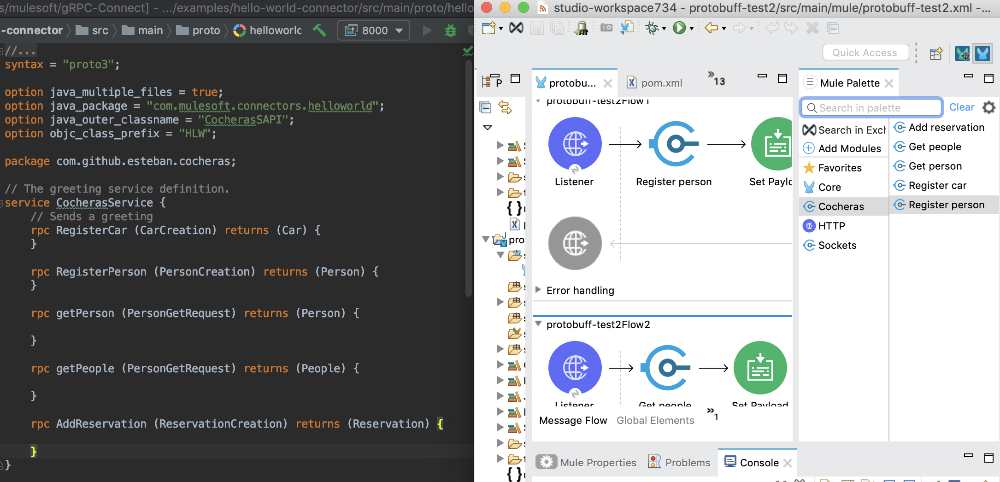

# gRPC Mule Connect
Set of tools and plugins to create OOTB Mule 4 Connectors from Protobuf definitions and connect agains gRPC Servers



# How to use

Clone repository and install it on your local M2 repo doing `mvn clean install` on the root of the project.

This action will install everything necessary to create your connectors based on gRPC Specifications.

## Connector Structure

To create a connector based on gRPC is necessary to create an empty Maven project with the following POM file:

```xml
<?xml version="1.0" encoding="UTF-8"?>
<project xmlns="http://maven.apache.org/POM/4.0.0"
         xmlns:xsi="http://www.w3.org/2001/XMLSchema-instance"
         xsi:schemaLocation="http://maven.apache.org/POM/4.0.0 http://maven.apache.org/xsd/maven-4.0.0.xsd">
    <modelVersion>4.0.0</modelVersion>

    <parent>
        <groupId>com.mulesoft.connectors</groupId>
        <artifactId>gRPC-connect-parent-pom</artifactId>
        <version>1.0.0-SNAPSHOT</version>
    </parent>

    <groupId>com.mulesoft.connectors</groupId>
    <artifactId>hello-world-grpc-connector</artifactId>
    <version>1.0.0-SNAPSHOT</version>
    <packaging>mule-extension</packaging>

    <name>Hello World gRPC Based Connector</name>

</project>
```

Where the important thing is the Parent POM where all the logic of creating gRPC based connector lives.

```xml
    <parent>
        <groupId>com.mulesoft.connectors</groupId>
        <artifactId>gRPC-connect-parent-pom</artifactId>
        <version>1.0.0-SNAPSHOT</version>
    </parent>
```

## Placing the Proto file

The proto file should be placed on `src/main/proto`.

## THATS ALL!! 🎉🎉🎉🎉🎉

Yes, I'm not lying this is all you need to do for having a gRPC based connector.

Just `mvn clean install` on the connector project, copy the GAV (GroupId, ArtifactId and Version) and add the `mule-plugin` classifier,
based on our example of above would be:

```xml
<dependency>
    <groupId>com.mulesoft.connectors</groupId>
    <artifactId>hello-world-grpc-connector</artifactId>
    <version>1.0.0-SNAPSHOT</version>
    <classifier>mule-plugin</classifier>
</dependency>
```
Copy and paste this inside of the Mule application POM file in Studio and enjoy!!!
